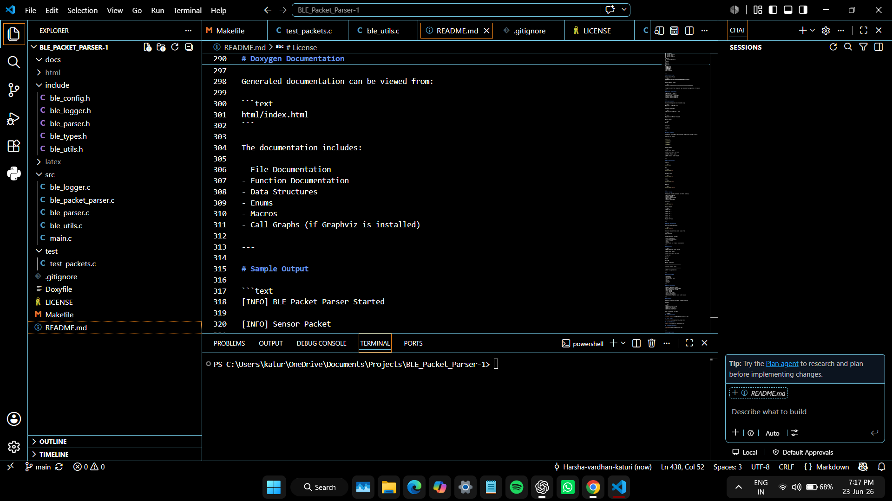
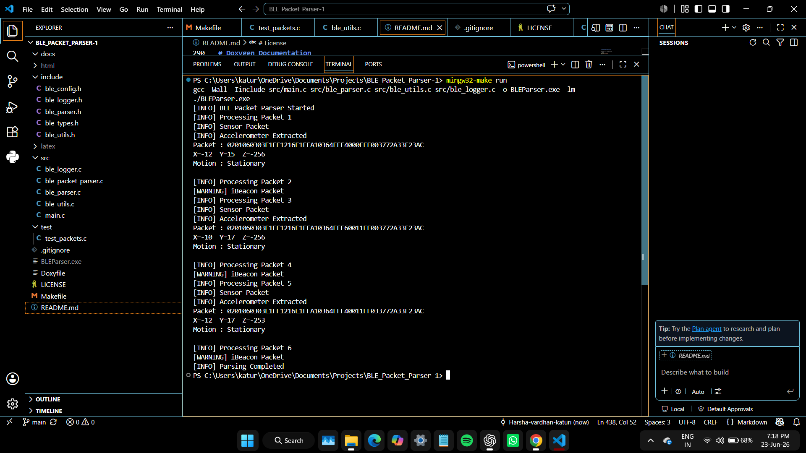
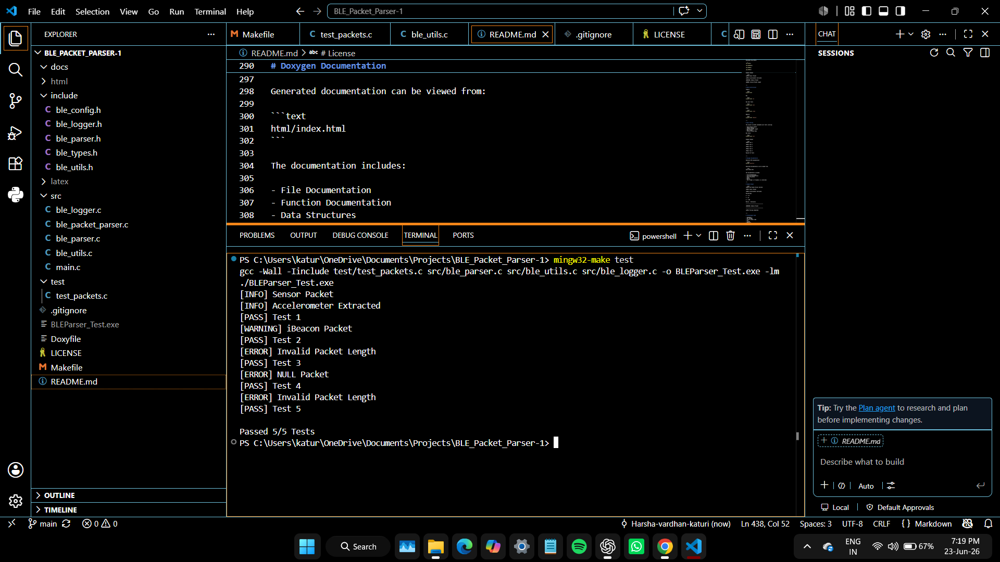
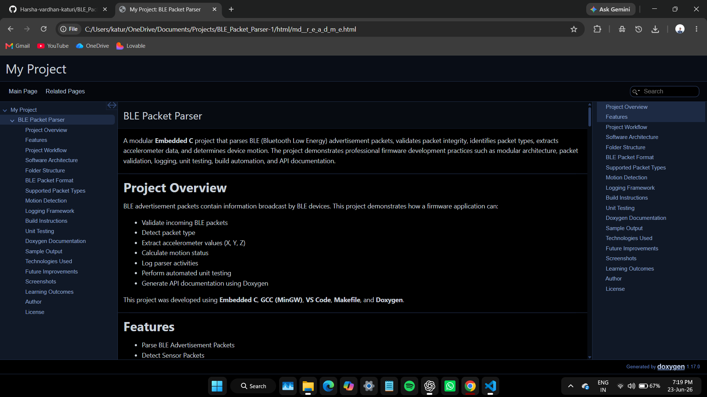

# BLE Packet Parser


A modular **Embedded C** project that parses BLE (Bluetooth Low Energy) advertisement packets, validates packet integrity, detects packet types, extracts accelerometer data, and determines motion status. The project demonstrates professional firmware development practices including modular architecture, packet validation, logging, unit testing, Makefile-based builds, and Doxygen documentation.

---

# Project Overview

BLE advertisement packets contain information broadcast by BLE devices. This project demonstrates how a firmware application can:

- Validate incoming BLE packets
- Detect packet types (Sensor / iBeacon / Unknown)
- Extract accelerometer values (X, Y, Z)
- Calculate motion status
- Log parser activities
- Perform automated unit testing
- Generate API documentation using Doxygen

Developed using **Embedded C**, **GCC (MinGW)**, **Visual Studio Code**, **Makefile**, and **Doxygen**.

---

# Features

- BLE Advertisement Packet Parsing
- Packet Validation
- Packet Type Detection
- Accelerometer Data Extraction
- Motion Detection
- Logging Framework
- Modular Architecture
- Unit Testing
- Makefile Build System
- Doxygen Documentation

---

# Project Highlights

- Modular Embedded C Architecture
- Structures and Enums
- Error Handling using Status Codes
- Configuration using Macros
- Logging Abstraction
- Unit Testing
- Professional Folder Organization

---

# Project Workflow

```text
BLE Advertisement Packet
        │
        ▼
Packet Validation
        │
        ▼
Packet Type Detection
        │
        ▼
BLE Packet Parser
        │
        ▼
Accelerometer Extraction
        │
        ▼
Motion Detection
        │
        ▼
Logger Output
```

---

# Software Architecture

```text
main.c
   │
   ▼
ble_parser.c
   ├── validate_packet()
   ├── detect_packet_type()
   └── parse_ble_packet()
   │
   ▼
ble_utils.c
   ├── is_ibeacon()
   ├── is_moving()
   └── motion_to_string()
   │
   ▼
ble_logger.h
```

---

# Folder Structure

```text
BLE_Packet_Parser
│
├── include/
│   ├── ble_config.h
│   ├── ble_logger.h
│   ├── ble_parser.h
│   ├── ble_types.h
│   └── ble_utils.h
│
├── src/
│   ├── main.c
│   ├── ble_parser.c
│   ├── ble_utils.c
│   └── ble_logger.c
│
├── test/
│   └── test_packets.c
│
├── docs/
├── images/
├── Doxyfile
├── Makefile
├── README.md
├── LICENSE
└── .gitignore
```

---

# BLE Packet Format

Sensor Packet

```text
0201060303E1FF1216E1FFA10364FFF4000FFF003772A33F23AC
```

iBeacon Packet

```text
0201061AFF4C00021553594F4F4B534F4349414C444953544500000000E8
```

---

# Motion Detection

```text
Magnitude = √(X² + Y² + Z²)

Magnitude(g) = Magnitude / 16384
```

If the magnitude exceeds the configured threshold, the device is classified as **Moving**; otherwise it is **Stationary**.

---

# Logging Framework

```c
LOG_INFO(...)
LOG_WARNING(...)
LOG_ERROR(...)
LOG_DEBUG(...)
```

Example:

```text
[INFO] Sensor Packet
[INFO] Accelerometer Extracted
[WARNING] iBeacon Packet
[ERROR] Invalid Packet Length
```

---

# Requirements

- GCC (MinGW)
- GNU Make (mingw32-make)
- Visual Studio Code (optional)
- Doxygen (optional)

---

# Installation

```bash
git clone https://github.com/harsha-vardhan-katuri/BLE_Packet_Parser.git
cd BLE_Packet_Parser
```

---

# Build Instructions

Compile

```bash
mingw32-make
```

Run

```bash
mingw32-make run
```

Run Tests

```bash
mingw32-make test
```

Clean

```bash
mingw32-make clean
```

Rebuild

```bash
mingw32-make rebuild
```

---

# Unit Testing

Current test coverage:

- Valid Sensor Packet
- iBeacon Packet
- Invalid Packet Length
- Invalid Packet Data
- NULL Packet

Example:

```text
[PASS] Test 1
[PASS] Test 2
[PASS] Test 3
[PASS] Test 4
[PASS] Test 5

Passed 5/5 Tests
```

---

# Doxygen Documentation

Generate documentation:

```bash
doxygen Doxyfile
```

Open:

```text
html/index.html
```

---

# Sample Output

```text
[INFO] BLE Packet Parser Started

[INFO] Sensor Packet
[INFO] Accelerometer Extracted

Parsed Data:
X = -12
Y = 15
Z = -256

Motion Status : Stationary

[WARNING] iBeacon Packet

[INFO] Parsing Completed
```

---

# Screenshots

Place the following images inside the `images/` folder.

## Project Structure



## Parser Output



## Unit Test Results



## Doxygen Documentation



---

# Technologies Used

- Embedded C
- GCC (MinGW)
- Visual Studio Code
- Git
- GitHub
- Makefile
- Doxygen

---

# Future Improvements

- Support Eddystone Packets
- Parse Manufacturer Specific Data
- Binary BLE Packet Parsing
- UART Logging
- JSON Export
- Unity Test Framework
- GitHub Actions CI

---

# Learning Outcomes

- Modular Embedded C Programming
- BLE Packet Parsing
- Packet Validation
- Motion Detection
- Logging Framework
- Unit Testing
- Makefile Build Automation
- API Documentation
- Git Version Control

---
---

# Final Recommendations

This project can be further enhanced by implementing the following features:

- Support additional BLE advertisement formats such as **Eddystone** and **Manufacturer Specific Data**.
- Parse binary BLE packets directly from BLE hardware instead of hexadecimal strings.
- Integrate UART/USB logging for deployment on embedded hardware platforms.
- Export parsed sensor data in JSON or CSV format for external applications.
- Add Continuous Integration (GitHub Actions) to automatically build and execute unit tests on every commit.
- Integrate a professional C unit testing framework such as **Unity** or **CMock**.
- Extend support for multiple sensor payload formats and configurable motion detection thresholds.

These enhancements will improve the project's scalability, maintainability, and suitability for production-grade embedded firmware development.

# Author

**Katuri Harsha Vardhan**

Firmware Engineer

GitHub: https://github.com/harsha-vardhan-katuri

---

# License

This project is licensed under the **MIT License**.
